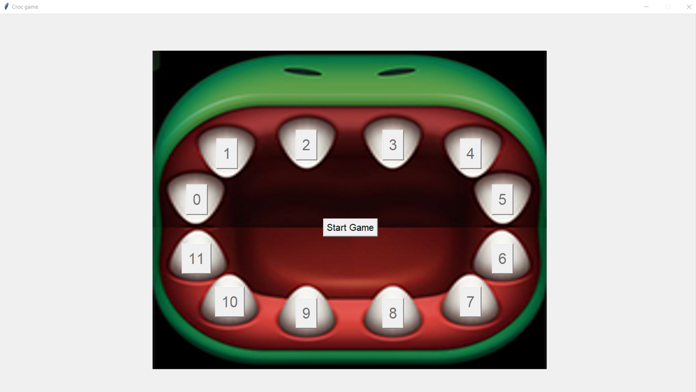
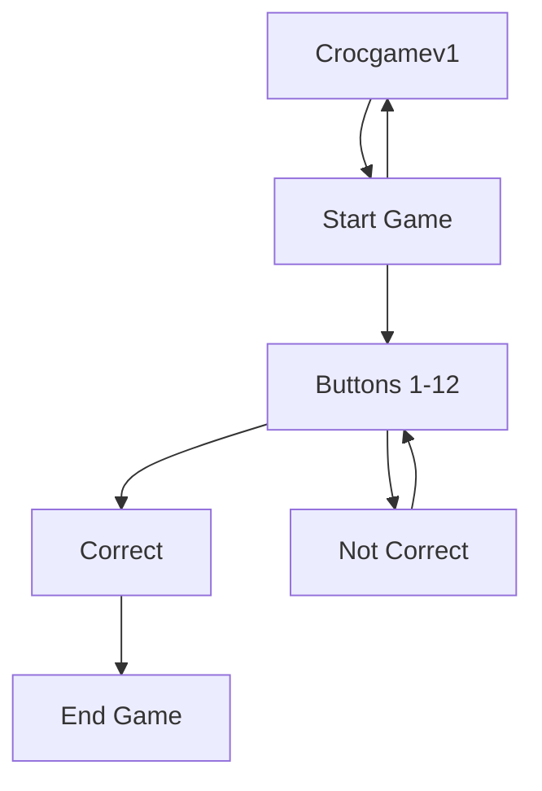
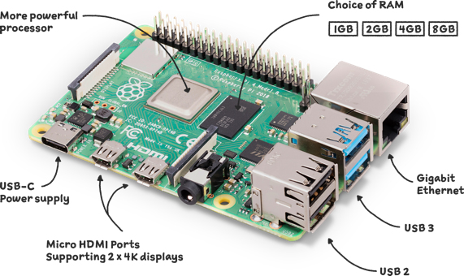
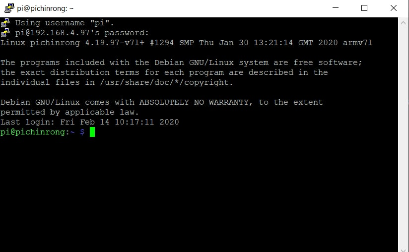
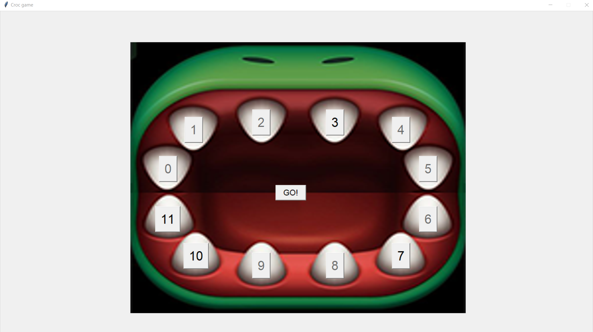

# Croc Game Documentation

This Documentation is regarding a Croc game and its features. This GUI is to send a Pixelised image of a crocodile to the poloriser.

# Croc Game GUI



*Photo of Croc Game GUI*

# System Diagram
## Hardware

Software

*Crocgame Flowchart*

# Hardware Used
Model of hardware : RaspberryPi 4 Model B
Version : Raspbian GNU Linux 10 Buster

*Photo of Raspberry Pi*

[Source](https://www.raspberrypi.com/products/raspberry-pi-4-model-b/)

# Software Setup & Installation 
## Setting up of the Raspberry PI

### PuTTy
After installing PuTTy, Change your desired **hostname** and **Connection Type** to "**SSH**" <br>
Input a name under **Saved Sessions** and click on save, the file will appear at the left hand side of the Settings. <br> 
Click the file once and load it. <br>
To finish it off, click **Open**.

 <br>
*Photo of PuTTy Setup*


Enter your username and password. The default login for User is "pi" and the Password is "raspberry".

 <br>
*Photo of PuTTy CMD*

To change your password, use the following command
``` 
sudo passwd
```

## 1. Updating of Raspberry Pi

```
sudo apt update
sudo apt upgrade
```

## 2. Configuring of Raspberry Pi
SSH is a network communication protocol that enables two computers to communicate and share data.
To **enable** SSH, type the following
```
sudo raspi-config
```

Select `3 Interface Options` <br>
Select `P2 SSH` <br>
**Enable SSH**

### Enabling Virtual Network Computing (VNC)
**VNC** is a cross-platform screen sharing system that can be used to remotely control another computer. 
<br>

To **enable** VNC, type the following
```
sudo raspi-config
```
Select `3 Interface Options` <br>
Select `P3 VNC` <br>
Select  **Enable VNC**
# Softwares to install
Install Pillow
```
pip install pillow

sudo apt-get install python3-pil.imagetk
```

# Setting up for the game
Import the tkinter to library. 

```
from tkinter import *
```
Import Pillow to View Images
```
from PIL import ImageTk, Image
```
Import Randomiser
```
from random import randrange
```
# How to play
This is a Croc game (Random Choice) Roulette game featuring a terrifying crocodile.

When the game is started the objective is try to survive (Last man standing).


*Photo of the game when start button is pressed*

While clicking on the buttons (only 1 button per click) a random number has already been selected as the "Incorrect teeth".


Finally if you were to click on the "Incorrect teeth" the game will end.


# Creating Functions
Setting button1 to 12 to Normal State when game is started, and sending image over to the poloriser
```
def startgame(i):
    global status
    btnStartGame = 0
    if btnStartGame == 0:
        button1["state"]= NORMAL
        button2["state"]= NORMAL
        button3["state"]= NORMAL
        button4["state"]= NORMAL
        button5["state"]= NORMAL
        button6["state"]= NORMAL
        button7["state"]= NORMAL
        button8["state"]= NORMAL
        button9["state"]= NORMAL
        button10["state"]= NORMAL
        button11["state"]= NORMAL
        button12["state"]= NORMAL
        btnStartGameList[i]["text"] = "  GO!  "
        pubpic([[5, 7, 7, 7, 7, 7, 7, 7, 7, 6, 4, 4, 4, 4, 4, 4, 4, 4, 4, 4, 4, 4, 6, 7, 7, 
        7, 7, 7, 7, 7, 7, 7], [5, 7, 7, 7, 7, 7, 3, 2, 2, 2, 2, 1, 2, 2, 2, 2, 2, 2, 
        2, 2, 1, 2, 2, 2, 2, 3, 7, 7, 7, 7, 7, 7], [7, 7, 7, 7, 7, 2, 2, 1, 1, 1, 1, 
        0, 1, 2, 1, 1, 1, 1, 2, 1, 0, 1, 1, 1, 1, 2, 2, 7, 7, 7, 7, 7], [7, 7, 7, 5, 
        2, 1, 1, 1, 0, 0, 0, 0, 0, 0, 0, 0, 0, 0, 0, 0, 0, 0, 0, 0, 1, 1, 1, 2, 4, 7, 7, 7], [7, 7, 3, 2, 1, 0, 0, 0, 0, 0, 0, 0, 0, 0, 0, 0, 0, 0, 0, 0, 0, 0, 0, 0, 0, 0, 0, 1, 2, 3, 7, 7], [7, 7, 2, 1, 0, 0, 1, 2, 3, 3, 3, 3, 3, 3, 3, 3, 3, 3, 3, 3, 3, 3, 3, 3, 2, 1, 0, 0, 1, 2, 7, 7], [7, 3, 2, 0, 1, 4, 2, 2, 2, 1, 1, 2, 3, 2, 1, 1, 1, 1, 2, 3, 2, 1, 1, 1, 2, 2, 4, 1, 0, 2, 3, 7], [7, 2, 1, 2, 4, 4, 4, 2, 1, 1, 4, 7, 7, 7, 4, 1, 1, 4, 7, 7, 7, 4, 1, 1, 2, 4, 4, 4, 2, 1, 2, 7], [4, 2, 2, 3, 7, 7, 7, 7, 2, 3, 7, 7, 7, 7, 7, 4, 4, 7, 7, 7, 7, 7, 3, 2, 7, 7, 7, 7, 4, 2, 2, 4], [3, 2, 4, 4, 7, 7, 7, 7, 4, 4, 3, 7, 7, 7, 7, 4, 4, 3, 7, 7, 7, 3, 4, 4, 7, 7, 7, 7, 4, 4, 2, 3], [3, 5, 3, 3, 7, 7, 7, 7, 5, 5, 5, 7, 7, 7, 6, 6, 6, 6, 7, 7, 7, 5, 5, 5, 7, 7, 7, 7, 3, 3, 5, 3], [3, 5, 3, 3, 3, 7, 7, 7, 5, 5, 5, 6, 7, 7, 5, 5, 5, 5, 7, 7, 6, 5, 5, 5, 7, 
        7, 7, 3, 3, 3, 4, 3], [3, 5, 4, 7, 4, 7, 7, 5, 5, 5, 5, 5, 5, 5, 5, 5, 5, 5, 
        5, 5, 5, 5, 5, 5, 5, 7, 7, 3, 7, 4, 5, 3], [4, 7, 7, 7, 7, 7, 6, 5, 5, 5, 5, 
        5, 5, 5, 5, 5, 5, 5, 5, 5, 5, 5, 5, 5, 5, 6, 7, 7, 7, 7, 7, 5], [5, 7, 7, 7, 
        7, 7, 6, 6, 5, 6, 6, 6, 6, 6, 6, 5, 5, 6, 6, 6, 6, 6, 6, 5, 6, 6, 7, 7, 7, 7, 7, 5], [4, 6, 7, 7, 7, 6, 6, 6, 6, 6, 6, 6, 6, 6, 6, 6, 6, 6, 6, 6, 6, 6, 6, 6, 6, 6, 6, 7, 7, 7, 6, 4], [4, 5, 7, 7, 7, 5, 6, 6, 6, 5, 5, 5, 5, 5, 5, 5, 5, 5, 5, 5, 5, 5, 5, 6, 6, 6, 5, 7, 7, 7, 5, 4], [4, 6, 5, 6, 5, 5, 6, 6, 5, 5, 5, 5, 5, 5, 5, 5, 5, 5, 5, 5, 5, 5, 5, 5, 6, 6, 5, 6, 6, 5, 5, 4], [4, 4, 4, 7, 7, 4, 4, 5, 4, 4, 3, 3, 3, 3, 3, 3, 3, 3, 3, 3, 3, 3, 4, 4, 5, 5, 4, 7, 7, 5, 4, 4], [4, 4, 7, 7, 7, 5, 4, 5, 4, 3, 3, 3, 3, 3, 3, 3, 3, 3, 3, 3, 3, 3, 3, 4, 4, 5, 4, 7, 7, 7, 4, 4], [4, 5, 7, 7, 7, 7, 4, 5, 4, 3, 3, 3, 3, 3, 3, 3, 3, 3, 3, 3, 3, 3, 3, 3, 4, 5, 7, 7, 7, 7, 5, 4], [5, 3, 7, 7, 7, 7, 4, 5, 4, 3, 3, 3, 3, 3, 3, 3, 2, 2, 3, 2, 3, 3, 3, 3, 4, 4, 7, 7, 7, 7, 2, 5], [4, 3, 7, 7, 7, 4, 7, 4, 4, 3, 2, 2, 2, 2, 2, 2, 2, 2, 2, 2, 2, 2, 3, 3, 4, 
        7, 7, 7, 7, 7, 3, 4], [3, 4, 2, 0, 0, 7, 7, 7, 4, 4, 3, 2, 3, 1, 1, 1, 1, 1, 
        1, 2, 2, 3, 3, 4, 7, 7, 7, 0, 0, 2, 4, 3], [3, 4, 3, 2, 7, 7, 7, 7, 4, 5, 4, 
        7, 7, 7, 3, 3, 3, 3, 7, 7, 7, 4, 4, 4, 7, 7, 7, 7, 2, 3, 4, 3], [5, 3, 3, 2, 
        7, 7, 7, 7, 2, 0, 0, 7, 7, 7, 0, 0, 0, 0, 7, 7, 7, 0, 0, 3, 7, 7, 7, 7, 2, 3, 3, 5], [7, 3, 4, 3, 7, 7, 7, 7, 1, 0, 7, 7, 7, 7, 7, 0, 0, 7, 7, 7, 7, 7, 0, 1, 7, 7, 7, 7, 3, 4, 3, 7], [7, 5, 2, 4, 1, 7, 7, 7, 0, 0, 7, 7, 7, 7, 7, 0, 0, 7, 7, 7, 7, 7, 0, 0, 7, 7, 7, 1, 4, 2, 5, 7], [7, 7, 4, 2, 5, 3, 3, 2, 2, 1, 1, 7, 7, 7, 0, 1, 1, 0, 7, 7, 7, 1, 1, 2, 2, 3, 3, 5, 2, 4, 7, 7], [7, 7, 7, 5, 2, 2, 4, 4, 3, 3, 3, 3, 3, 3, 3, 3, 3, 3, 3, 3, 3, 3, 3, 3, 4, 4, 2, 2, 4, 7, 7, 7], [7, 7, 7, 7, 6, 4, 2, 2, 2, 2, 2, 2, 2, 2, 2, 2, 2, 2, 2, 2, 2, 2, 2, 2, 2, 2, 4, 6, 7, 7, 7, 7], [7, 7, 7, 7, 7, 7, 7, 7, 6, 6, 6, 6, 6, 6, 6, 6, 6, 6, 6, 6, 6, 6, 6, 6, 7, 7, 7, 7, 7, 7, 7, 7]])

    else:
        btnStartGame["state"]= NORMAL
        button1["state"]= DISABLED
        button2["state"]= DISABLED
        button3["state"]= DISABLED
        button4["state"]= DISABLED
        button5["state"]= DISABLED
        button6["state"]= DISABLED
        button7["state"]= DISABLED
        button8["state"]= DISABLED
        button9["state"]= DISABLED
        button10["state"]= DISABLED
        button11["state"]= DISABLED
        button12["state"]= DISABLED
        btnStartGame = 1
        init()

        
    print("Game started")
```
To Check if the randomise number is the same value as the button click. If The randomise number is the same value it will end the game. If not it will keep checking for the same number. 
```
def process(i):
    global totalNumberOfGuesses, buttons
    guess = i
    if guess == secretNumber:
        
        print("GameOver!")
        pubpic([[7, 7, 7, 7, 7, 7, 7, 7, 7, 7, 7, 7, 7, 7, 7, 7, 7, 7, 7, 7, 7, 7, 7, 7, 7, 7, 7, 7, 7, 7, 7, 7], [7, 7, 7, 4, 2, 1, 1, 2, 4, 7, 7, 7, 7, 7, 7, 7, 7, 7, 7, 7, 7, 7, 7, 4, 2, 1, 1, 2, 4, 7, 7, 7], [7, 7, 3, 1, 0, 0, 0, 0, 1, 2, 7, 7, 
        7, 7, 7, 7, 7, 7, 7, 7, 7, 7, 2, 1, 0, 0, 0, 0, 1, 3, 7, 7], [7, 4, 2, 1, 0, 0, 0, 0, 0, 0, 1, 4, 7, 7, 7, 7, 7, 7, 7, 7, 5, 1, 0, 0, 0, 0, 0, 0, 1, 2, 4, 7], [5, 4, 1, 3, 1, 0, 0, 0, 0, 0, 0, 1, 2, 3, 7, 7, 7, 7, 3, 2, 1, 0, 0, 0, 0, 0, 0, 1, 3, 1, 4, 5], [5, 3, 0, 6, 4, 3, 0, 0, 0, 0, 0, 0, 0, 0, 1, 1, 1, 1, 
        0, 0, 0, 0, 0, 0, 0, 0, 3, 4, 1, 0, 2, 5], [5, 0, 5, 6, 7, 7, 4, 2, 1, 1, 0, 0, 0, 0, 0, 0, 0, 0, 0, 0, 0, 0, 1, 1, 2, 4, 7, 6, 6, 5, 0, 5], [5, 0, 6, 7, 7, 7, 6, 5, 1, 1, 0, 0, 0, 0, 0, 0, 0, 0, 0, 0, 0, 0, 1, 1, 5, 6, 7, 7, 7, 6, 0, 5], [5, 0, 6, 7, 7, 7, 6, 6, 0, 1, 1, 1, 0, 0, 0, 0, 0, 0, 0, 0, 1, 1, 1, 0, 
        6, 6, 7, 7, 7, 6, 0, 5], [5, 0, 6, 6, 7, 7, 6, 2, 2, 2, 2, 2, 1, 1, 1, 1, 1, 1, 1, 1, 1, 2, 2, 2, 2, 6, 7, 7, 6, 6, 0, 5], [5, 0, 0, 6, 6, 2, 2, 2, 2, 2, 2, 2, 2, 2, 2, 2, 2, 2, 2, 2, 2, 2, 2, 2, 2, 2, 2, 6, 6, 0, 0, 5], [5, 4, 0, 3, 
        2, 2, 2, 2, 2, 2, 2, 2, 2, 2, 2, 2, 2, 2, 2, 2, 2, 2, 2, 2, 2, 2, 2, 2, 3, 0, 
        3, 5], [5, 4, 3, 3, 2, 2, 2, 1, 1, 1, 1, 1, 1, 1, 1, 1, 1, 1, 1, 1, 1, 1, 1, 1, 1, 2, 2, 3, 3, 3, 4, 5], [5, 4, 4, 3, 3, 2, 1, 1, 1, 1, 1, 1, 0, 0, 0, 0, 0, 0, 0, 0, 1, 1, 1, 1, 1, 1, 2, 3, 3, 4, 4, 5], [5, 4, 4, 3, 2, 1, 1, 1, 1, 0, 
        1, 6, 6, 1, 0, 0, 0, 0, 1, 6, 6, 0, 0, 1, 1, 1, 1, 2, 3, 4, 4, 5], [5, 5, 4, 3, 2, 1, 1, 1, 1, 1, 1, 1, 1, 0, 1, 1, 1, 1, 0, 1, 1, 1, 1, 1, 1, 1, 1, 2, 3, 4, 5, 5], [5, 5, 4, 3, 2, 1, 1, 1, 1, 1, 1, 1, 1, 1, 1, 1, 1, 1, 1, 1, 1, 1, 1, 1, 1, 1, 1, 2, 3, 4, 5, 5], [5, 5, 4, 3, 2, 1, 1, 1, 1, 1, 2, 2, 2, 2, 2, 2, 
        2, 2, 2, 2, 2, 2, 1, 1, 1, 1, 1, 2, 3, 4, 5, 5], [5, 5, 4, 3, 2, 2, 2, 2, 2, 2, 2, 3, 3, 3, 3, 3, 3, 3, 3, 3, 3, 2, 2, 2, 2, 2, 2, 2, 3, 4, 5, 5], [5, 5, 4, 3, 3, 3, 2, 2, 3, 3, 3, 3, 3, 3, 3, 3, 3, 3, 3, 3, 3, 3, 3, 3, 2, 2, 3, 3, 3, 4, 5, 5], [5, 5, 4, 3, 3, 3, 3, 3, 3, 3, 3, 3, 3, 3, 3, 3, 3, 3, 3, 3, 3, 3, 
        3, 3, 3, 3, 3, 3, 3, 4, 5, 5], [5, 5, 4, 4, 3, 3, 3, 3, 3, 3, 3, 3, 3, 3, 3, 3, 3, 3, 3, 3, 3, 3, 3, 3, 3, 3, 3, 3, 4, 4, 5, 5], [5, 5, 4, 4, 4, 0, 3, 3, 3, 3, 3, 3, 3, 3, 3, 3, 3, 3, 3, 3, 3, 3, 3, 3, 3, 3, 0, 4, 4, 4, 5, 5], [6, 5, 
        5, 4, 4, 4, 3, 3, 3, 3, 1, 0, 0, 5, 3, 3, 3, 3, 4, 0, 0, 0, 3, 3, 3, 3, 4, 4, 
        4, 5, 5, 6], [6, 5, 5, 4, 4, 4, 4, 4, 4, 4, 3, 0, 0, 4, 4, 4, 4, 4, 4, 0, 0, 4, 4, 4, 4, 4, 4, 4, 4, 5, 5, 6], [6, 5, 5, 5, 5, 4, 4, 4, 4, 4, 4, 4, 4, 4, 4, 4, 4, 4, 4, 4, 4, 4, 4, 4, 4, 4, 4, 5, 5, 5, 5, 6], [6, 6, 5, 5, 5, 5, 5, 4, 
        4, 4, 4, 4, 4, 4, 4, 4, 4, 4, 4, 4, 4, 4, 4, 4, 4, 4, 5, 5, 5, 5, 6, 6], [6, 6, 6, 5, 5, 5, 5, 5, 5, 5, 5, 5, 5, 5, 5, 5, 5, 5, 5, 5, 5, 5, 5, 5, 5, 5, 5, 5, 5, 6, 6, 6], [7, 6, 6, 6, 5, 5, 5, 5, 5, 5, 5, 5, 5, 5, 5, 5, 5, 5, 5, 5, 5, 5, 5, 5, 5, 5, 5, 5, 6, 6, 6, 6], [7, 7, 6, 6, 6, 6, 6, 5, 5, 5, 5, 5, 5, 5, 
        5, 5, 5, 5, 5, 5, 5, 5, 5, 5, 5, 6, 6, 6, 6, 6, 7, 7], [7, 7, 7, 7, 5, 6, 6, 6, 6, 6, 6, 6, 6, 6, 6, 6, 6, 6, 6, 6, 6, 6, 6, 6, 6, 6, 6, 5, 7, 7, 7, 7], [7, 7, 7, 7, 7, 7, 7, 6, 6, 6, 6, 6, 6, 6, 6, 6, 6, 6, 6, 6, 6, 6, 6, 6, 7, 7, 7, 7, 7, 7, 7, 7]])
        root.destroy()


    if i != secretNumber:
        if i == 0:
            button1["state"] = DISABLED
        elif i == 1:
            button2["state"] = DISABLED
        elif i == 2:
            button3["state"] = DISABLED
        elif i == 3:
            button4["state"] = DISABLED
        elif i == 4:
            button5["state"] = DISABLED
        elif i == 5:
            button6["state"] = DISABLED
        elif i == 6:
            button7["state"] = DISABLED
        elif i == 7:
            button8["state"] = DISABLED
        elif i == 8:
            button9["state"] = DISABLED
        elif i == 9:
            button10["state"] = DISABLED
        elif i == 10:
            button11["state"] = DISABLED
        elif i == 11:
            button12["state"] = DISABLED
```
 


